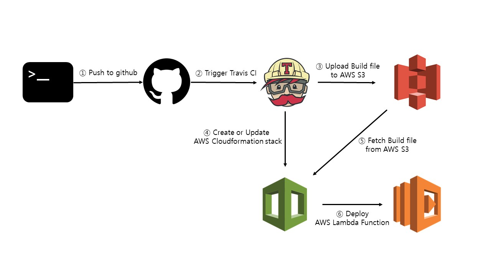
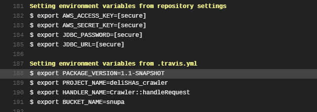

# BapMukSha_crawler

서울대학교 학식 정보 제공 어플리케이션 BapMukSha(밥먹샤)의 뒷단 크롤러입니다.

## batch 프로그램에 대한 고민

주기적으로 작동하는 크롤러를 만들기로 결정한 후 처음 들었던 고민은 '어떤 배치 서비스를 사용해야 하나' 하는 것이었다. 백엔드는 spring boot로 개발하고 AWS에 배포할 계획이었기 때문에 높은 통합성을 보이리라고 생각되는 spring batch, AWS batch 등을 검토해보았다. 

배치 서비스는 훌륭한 기능들을 다수 제공해주었지만 러닝커브가 생각보다 깊어보였고, 대용량 처리에 적합한 배치 프로그램은 가벼운 트래픽을 예상하는 우리 어플리케이션에는 과할 것 같다는 생각이 들었다. 그래서 배치 서비스를 이용한 프로그램을 만들기보다는 cron 등으로 간단하게 스케줄링하여 주기적으로 작업을 수행할 수 있게 해주는 정도로 구현하기로 했다.

## Serverless

Serverless application은 서버 인스턴스 위에 상주하지 않고 필요할 때만 호출되어 경제적이라는 이점이 있으며, 며칠에 한번씩만 크롤링을 수행하는 우리 어플리케이션의 특성은 이 이점과 특히 잘 어울린다고 생각했다. 기본적으로 배치 작업은 사용자와의 기민한 소통을 요구하지 않기 때문에 극한의 성능은 필요 없으며 serverless application의 한계라고 여겨지는 cold start에 관한 문제도 신경쓸 필요가 없어보였다. 따라서 AWS의 Lambda를 이용해 serverless 환경에서 동작하는 크롤러를 만들어보기로 결정했다.

## Cloudwatch Trigger

Cloudwatch는 aws에서 제공하는 모니터링 및 관찰 기능 서비스이다. lambda를 trigger할 수 있는 aws 서비스가 몇가지 있는데, cloudwatch는 cron expression을 사용해서 주기적으로 원하는 lambda function을 trigger할 수 있다. 또한 cloudwatch는 lambda function에서 남기는 로그를 쉽게 모니터링할 수 있다는 장점이 있다.

## Infrastructure

결론적으로, 학식 정보 크롤러의 인프라 구조는 아래와 같다.


## lambda function 만들기


코틀린을 사용해서 크롤러를 만들었기 때문에 runtime 환경은 java 11을 선택했고, 필요한 패키지들을 모두 포함한 단일 jar 파일이 필요했기 때문에 gradle의 shadowJar 플러그인을 추가하고 이를 이용해 빌드했다. (shadowJar 빌드를 하면 비륻 결과물 이름에 all 이라는 suffix가 붙는다.)


환경에 따라 바뀔 수 있는 값들은 모두 아래와 같이 환경변수화를 해놓았기 때문에, aws console에서 환경변수를 주입해주면 정상적으로 작동할 것을 기대할 수 있다.

```kotlin
class Constants {
    companion object {
        val BASE_CRAWL_URL: String = System.getenv("BASE_CRAWL_URL") ?: "http://snuco.snu.ac.kr/ko/foodmenu"
        val JDBC_URL: String = System.getenv("JDBC_URL") ?: "jdbc:mysql://localhost:3306/test_db?serverTimezone=UTC&characterEncoding=UTF-8"
        val JDBC_DRIVER: String = System.getenv("JDBC_DRIVER") ?: "com.mysql.cj.jdbc.Driver"
        val JDBC_USERNAME: String = System.getenv("JDBC_USERNAME") ?: "root"
        val JDBC_PASSWORD: String = System.getenv("JDBC_PASSWORD") ?: "password"
        val CRAWL_DAYS_UNTIL: Int = System.getenv("CRAWL_DAYS_UNTIL")?.toInt() ?: 3
    }
}
```


테스트로 람다 함수를 실행시켜본 결과 정상적으로 작동하는 것을 확인할 수 있었고, cloudwatch를 통해 내가 남긴 로그를 확인할 수 있었다.


RDS에 저장이 잘 되었는지를 mysql workbench에서 확인해본 결과 역시 데이터가 잘 저장되었음을 확인할 수 있었다.


## CI & CD 파이프라인 구축

Serverless 환경의 서비스를 만들면서 고민했던 점은 'Serverless 앱은 CI & CD 파이프라인을 어떻게 구축할 수 있을까?' 하는 것이었다. 프로젝트를 테스트하고 빌드하는 CI 과정까지는 배포 환경과 관련이 없으니 문제없다고 해도, CI 작업이 끝난 후 빌드 결과물을 서버에 배포하는 CD 과정은 확실히 기존의 방법과는 다른 무언가가 필요해 보였다.

마침 cloudformation이나 terraform 등의 IaC 도구들을 다뤄보고 싶다고 생각하던 참이었어서 이를 이번 파이프라인 구축에 사용해보기로 결정했다. 지금 프로젝트에서 AWS 인프라를 다수 사용하고 있기 때문에 우선은 맘편히 AWS에서 제공하는 cloudformation을 사용했다.

구축한 파이프라인의 대략적인 프로세스는 아래와 같다.



### .travis.yml

CI 작업을 위해 작성한 .travis.yml의 전체 코드는 아래와 같다.
```yaml
language: java
jdk:
  - openjdk11

env:
  global: # (1)
    - PACKAGE_VERSION=1.1-SNAPSHOT
    - PROJECT_NAME=deliSHAs_crawler
    - HANDLER_NAME=Crawler::handleRequest
    - BUCKET_NAME=snupa

branches:
  only:
    - master

cache:
  directories:
    - '$HOME/.gradle'

script: "./gradlew shadowJar" # (2)

deploy:
  - provider: s3 # (3)
    access_key_id: $AWS_ACCESS_KEY
    secret_access_key: $AWS_SECRET_KEY
    bucket: $BUCKET_NAME
    region: ap-northeast-2
    skip_cleanup: true
    acl: public_read
    local_dir: build/libs
    wait-until-deployed: true
    on:
      repo: BaekGeunYoung/deliSHAs_crawler
      branch: master

  - provider: cloudformation # (4)
    access_key_id: $AWS_ACCESS_KEY
    secret_access_key: $AWS_SECRET_KEY
    template: cloudformation.yml # (4-1)
    stack_name: DeployCrawler
    edge: true
    wait: true
    parameters: # (4-2)
      - LambdaCodeBucket=$BUCKET_NAME
      - LambdaCodeKey=${PROJECT_NAME}-${PACKAGE_VERSION}-all.jar
      - Lambdahandler=$HANDLER_NAME
      - JdbcUrl=$JDBC_URL
      - JdbcPassword=$JDBC_PASSWORD
    capabilities: CAPABILITY_IAM # (4-3)
    region: ap-northeast-2
```

#### 설명

(1) CI 과정 동안 전역적으로 사용할 변수들을 정의했다. 패키지 버전이나 파일을 저장할 S3 버킷 이름 등을 전역변수화했다.

(2) AWS lambda에 배포하기 위해선 실행가능한 단일 Jar이 필요하기 때문에 shadowJar 커맨드로 빌드를 하도록 했다

(3) 빌드 결과물을 S3에 업로드하는 부분이다. local_dir에 지정된 경로에 있는 파일들을 지정된 bucket에 업로드해준다.

(4) Cloudformation stack을 만들거나, 갱신하는 부분이다.

(4-1) 템플릿 파일의 경로를 지정해준다. 로컬 디렉토리의 경로를 지정할 수도 있고, S3에서 받아올 수도 있다.

(4-2) 템플릿 파일에 주입해줄 parameters를 정의한다. 환경에 따라 바뀔 수 있는 값들을 파라미터화하면 좋을 것이다.

(4-3) 템플릿에서 정의한 리소스 중에 IAM 리소스가 존재한다면 이 값을 CAPABILITY_IAM으로 설정해주어야한다. 나의 경우 배포된 lambda function을 실행하는 role을 지정해줘야했기 때문에 값을 설정해주었다.

#### .travis.yml에서 전역변수 설정하기 vs travis console에서 환경변수 설정하기

travis ci 과정에서 전역적으로 필요하거나 환경에 따라 바뀔 수 있는 값들을 변수화하는 방법은 두 가지가 있다.

**1번: .travis.yml에서 .env.global 설정하기**

**2번: travis 콘솔 -> settings에서 environment variables 설정하기**

내 생각에 각각의 방법은 아래와 같은 상황에서 사용하면 적절할 것 같다.

**1번: 어플리케이션의 버전을 업데이트함에 따라 함께 바뀔 가능성이 높은 변수**

**2번: 바뀔 가능성이 낮거나, 보안에 민감한 변수**

2번 방법으로 설정한 변수들은 아래와 같이 빌드 과정에서 암호화되어 있는 것을 확인할 수 있다.



### cloudformation template

cloudformation stack을 생성하기 위해서는 템플릿이 필요한데, 템플릿은 내가 구축하고 싶은 인프라의 구성을 코드로 작성한 파일이다. yaml 혹은 json의 형식을 사용할 수 있다.

`cloudformation.yml`
```yaml
AWSTemplateFormatVersion: 2010-09-09
Parameters: # (1)
  LambdaCodeBucket:
    Type: String
    Description: S3 bucket in which custom lambda code is stored
  LambdaCodeKey:
    Type: String
    Description: Jar file name in which custom lambda code is stored
    Default: deliSHAs_crawler-1.0-SNAPSHOT-all.jar
  Lambdahandler:
    Type: String
    Description: Python file name which is packed inside the zip file
    Default: Crawler::handleRequest
  JdbcUrl:
    Type: String
    Description: Jdbc url which lambda function would use
  JdbcPassword:
    Type: String
    Description: Jdbc password for db connection

Resources: # (2)
  LambdaIAMRole: # (3)
    Type: 'AWS::IAM::Role'
    Properties:
      AssumeRolePolicyDocument:
        Version: 2012-10-17
        Statement:
          - Effect: Allow
            Principal:
              Service:
                - lambda.amazonaws.com
            Action:
              - 'sts:AssumeRole'
      Path: /
      Policies:
        - PolicyName: root
          PolicyDocument:
            Version: 2012-10-17
            Statement:
              - Effect: Allow
                Action:
                  - 's3:*'
                Resource: '*'
              - Effect: Allow
                Action:
                  - 'logs:CreateLogGroup'
                  - 'logs:CreateLogStream'
                  - 'logs:PutLogEvents'
                Resource: 'arn:aws:logs:*:*:*'

  CustomResourceLambdaFunction: # (4)
    Type: 'AWS::Lambda::Function'
    Properties:
      Handler: !Ref Lambdahandler
      Role: !GetAtt LambdaIAMRole.Arn # (4-1)
      FunctionName: 'deliSHAs_crawler_test'
      Code: # (4-2)
        S3Bucket: !Ref LambdaCodeBucket
        S3Key: !Ref LambdaCodeKey
      Runtime: java11 # (4-3)
      Timeout: 60
      Environment: # (4-4)
        Variables:
          BASE_CRAWL_URL: 'http://snuco.snu.ac.kr/ko/foodmenu'
          JDBC_DRIVER: 'com.mysql.cj.jdbc.Driver'
          JDBC_PASSWORD: !Ref JdbcPassword
          JDBC_URL: !Ref JdbcUrl
          JDBC_USERNAME: 'root'

  ScheduledRule: # (5)
    Type: AWS::Events::Rule
    Properties:
      Description: "Scheduled Rule"
      ScheduleExpression: "rate(10 minutes)"
      State: "DISABLED"
      Targets:
         - Arn: !GetAtt CustomResourceLambdaFunction.Arn
           Id: "TargetFunctionV1"
  
  PermissionForEventsToInvokeLambda: # (6)
    Type: AWS::Lambda::Permission 
    Properties:
      FunctionName: !GetAtt CustomResourceLambdaFunction.Arn
      Action: "lambda:InvokeFunction"
      Principal: "events.amazonaws.com"
      SourceArn: !GetAtt ScheduledRule.Arn 

```

#### 설명

(1) stack 생성 시 외부에서 주입받을 파라미터들의 목록을 정의한다. 여기에 선언한 파라미터들을 .travis.yml 에서 주입해주면 된다. 

(2) 이 템플릿 파일을 통해 구성할 AWS Resource의 목록을 나열한다. 여기서는 아래와 같이 총 4개의 리소스를 정의한다.

- 배포할 AWS lambda function
- lambda function에 대한 실행 Role
- 주기적으로 lambda를 trigger할 cloudwatch event
- cloudwatch event가 lambda를 실행할 수 있도록 허용해주는 lambda permission

(3) lambda function을 만들 때는 이 function을 실행할 역할을 지정해주어야 한다. lambda function 코드를 S3로부터 가져와야 하므로 이 역할에 S3에 관한 권한을 할당해주고, 로그 기록을 위해 로그 관련 권한도 할당해주었다.

(4) 우리가 배포할 AWS lambda 리소스에 대한 정의이다.

(4-1) 2-1에서 만든 Role의 arn을 적용해준다.

(4-2) function 코드를 어디서 받아올 것인지 설정한다. 여기서는 S3에서 코드를 가져오도록 했고, bucket 이름과 빌드 파일의 이름은 파라미터화해놓은 것을 사용한다.

(4-3) 함수가 실행될 런타임 환경을 정의한다. 나는 함수를 kotlin으로 작성했기 때문에 java11을 선택했다.

(4-4) 함수가 실행되는 환경에서의 환경변수를 정의한다. 바로 적어줄 수 있는 것들은 native string으로 적어주었고, 나머지는 파라미터로 받아오도록 했다.

(5) lambda를 주기적으로 trigger할 cloudwatch event를 rule과 함께 생성하기 위한 리소스이다. ScheduledExpression 필드에서 rate expression 혹은 cron expression을 사용할 수 있다.

(6) 이 리소스는 타 AWS 리소스 혹은 AWS 계정에 해당 함수를 사용할 권한을 부여한다. ScheduledRule 리소스에 CustomResourceLambdaFunction 함수를 invoke할 권한을 부여해주었다.

### 문제

Serverless 애플리케이션과 Cloudformation 템플릿에 대한 CI & CD 파이프라인 구축을 멋지게 완성하였다. 하지만 한 가지 문제는, 원래 나는 cloudformation이 S3의 빌드 파일의 변화가 있을 때마다 stack을 업데이트하길 기대했는데 실제론 그렇지 않았다. cloudformation은 템플릿 파일의 내용이 변경될 때만 stack을 업데이트하고 있었다.(생각해보면 당연한 것..) 그래서 travis VM에 aws cli를 설치해 lambda 함수 코드를 업데이트하는 명령어를 deploy 스텝 이후에 입력해주었다.

우선 문제를 해결하기 위해 아래와 같은 새 파이프라인을 구상했다.


아래는 코드를 푸시할 때마다 lambda 함수를 s3로부터 받아와서 업데이트할 수 있도록 travis 스크립트를 수정한 내용이다.

`.travis.yml`
```yaml
(...생략)

before_install:
        - pip install -U pip
        - pip install --user awscli # (1)
        - mkdir -p ~/.aws
        - echo -e "[default]\naws_access_key_id = $AWS_ACCESS_KEY\naws_secret_access_key = $AWS_SECRET_KEY" > ~/.aws/credentials #(2)
        - cat ~/.aws/credentials

(...생략)

after_deploy: # (3)
        - aws lambda update-function-code
        --s3-bucket=snupa 
        --s3-key=${PROJECT_NAME}-${PACKAGE_VERSION}-all.jar
        --region=ap-northeast-2
        --function-name=[함수 이름 혹은 ARN]
```

#### 설명

(1) aws-cli를 설치한다.

(2) AWS credential를 설정해준다.

(3) deploy 스텝이 끝난 후에 실행할 명령어, update-function-code 명령으로 함수를 업데이트한다.


이렇게 travis를 실행하게 되면 아래처럼 성공적으로 lambda 함수 코드가 업데이트 되는 것을 확인할 수 있다.


### 요약

travis CI와 AWS cloudformation을 이용해 serverless 앱에 대한 CI & CD 파이프라인을 구축해보았다. 사실 본래의 목적을 달성하기 위해서 cloudformation은 필요없는 선택지였다는 것을 뒤늦게 깨달았지만, IaC 도구를 공부해보고 CI&CD와 연동해서 적용해본 것은 가치있는 경험이었다고 생각한다. cloudformation은 처음 사용해보는거라 미숙한 점이 많지만, 코드로 인프라를 관리하는 것의 매력을 확실히 느낄 수 있었고 AWS 전반에 대한 이해도 또한 한 층 높일 수 있었다.
